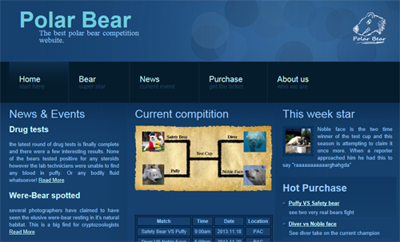
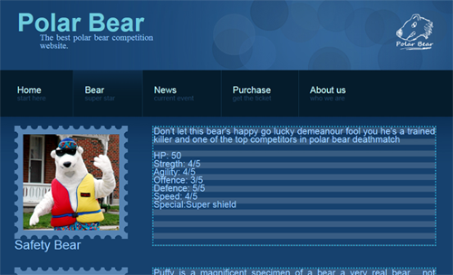

# Polar Bear Competition
Polar Bear Competition is a cmpt281 course project

### Keys of this project

* Built a website featuring of fictional polar bear competition to entertain people
* Followed the process funnel rules in design and implementation
* Coded in HTML, XML, CSS and Javascript
* Evaluated the website by using different evaluation methods
* Done with Kevin Squires, and William Selby at the end of 2013

### Screen Shot

